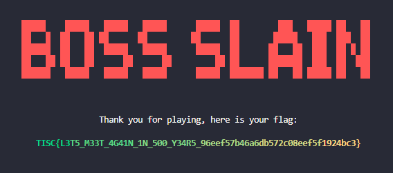

## Challenge 1: Slay The Dragon
We are given `slay_the_dragon.zip`, which contains the client and server side code. Everything is similar except the `boss.json` and `flag.txt`.

In order to get the flag, we need to defeat 3 bosses. The first boss is easy. The second boss can kill you if you don't heal every alternate turn. The third boss basically 1-hit KOs you. 

### Second Boss
You can mine for gold. But there's a chance that you will die. The random chance to die is client side, in `/client/event/workevent.py`. Simply comment it out to work like crazy.
```python
class WorkEvent:
    def __init__(self, client: GameClient) -> None:
        self.client = client

    def run(self):
        if random() <= CREEPER_ENCOUNTER_CHANCE:
            self.__die_to_creeper()
        self.__mine_safely()

    def __die_to_creeper(self):
        screens.display_creeper_screen()
        screens.display_game_over_screen()
        self.client.exit()

    def __mine_safely(self):
        screens.display_working_screen()
        for i in range(1000):
            self.client.send_command(Command.WORK)
```

Now with all the gold in the world you can buy unlimited potions and beat the second boss. 

### Third (and Final) Boss
But the third boss just kills you in 1 hit. We need to find a way to kill the boss before he can hit us. We can see the battle logic in `/server/service/battleservice.py`.

```python
        while True:
            self.history.log_commands_from_str(self.server.recv_command_str())

            match self.history.latest:
                case Command.ATTACK | Command.HEAL:
                    self.history.log_command(Command.BOSS_ATTACK)
                case Command.VALIDATE:
                    break
                case Command.RUN:
                    return
                case _:
                    self.server.exit(1)
``` 

Every attack and heal will cause the boss to hit you once. Well... not really, it will cause it to be "logged". On validation the logs are replayed and if you die in any point of time, you lose. 

Hmmm... `log_commands_from_str` (notice the `s`). The server should only process 1 command at a time, why command*s*? The second hint is that only the latest event in the history is considered in the switch case. This means that if we can squeeze thousands of ATTACK commands, we only get hit by the boss once (not if the boss is dead though). Let's look at `log_commands_from_str(...)`.

```python
def log_commands_from_str(self, commands_str: str):
        self.log_commands(
            [Command(command_str) for command_str in commands_str.split()]
        )
```

Now this is where we can hack the game. For some reason `split` is used on the command string. This means that if we can hack the client side to send "ATTACK ATTACK ATTACK ..." instead of just "ATTACK", we can attack the boss for as many times as we want before the boss can even hit us!

Let's look at how the client sends commands. Inside `client/event/battleevent.py`

```python
            match self.__get_battle_command():
                case Command.ATTACK:
                        self.__attack_boss()
                    if self.boss.is_dead:
                        break
                case Command.HEAL:
                    self.__use_potion()
                case Command.RUN:
                    self.client.send_command(Command.RUN)
                    return
                case _:
                    continue
```

We trace the `__attack_boss()` function...

```python
    def __attack_boss(self):
        self.client.send_command(Command.ATTACK)
        self.boss.receive_attack_from(self.player)
```

We track the `self.client.send_command(Command.ATTACK)` function... to `/client/gameclient.py`

```python
    def send_command(self, command: Command):
        self.__send(command.value)
```

The command is an Enum inside python. We can change it to this.

```python
    def send_command(self, command: Command):
        if command.value =="ATTACK":
            self.__send(" ".join(["ATTACK" for _ in range(1000)]))
        self.__send(command.value)
```

This way we can send "ATTACK ATTACK ATTACK ATTACK ..." instead of just "ATTACK". We sort of need to sync the client side too. I think there's a few ways to do this. We can either change `/client/event/battleevent.py`:

```python
        case Command.ATTACK:
            self.__attack_boss()
            if self.boss.is_dead:
                break
```

```python
        case Command.ATTACK:
            for _ in range(1000):
                self.__attack_boss()
            if self.boss.is_dead:
                break
```

This takes quite a while to load. Or we can just modify the player's damage to 1k. (Much Cooler.) `/core/config.py`

Wee!

