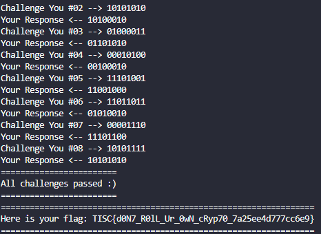

## Leaky Matrices
We are given a "2-Way-Key-Verification" scheme that basically uses a hill cipher. The secret key is used to cipher a given plaintext and you receive the ciphertext. We will need to recover the secret key. 

The secret key is an `8 x 8` matrix and its randomly generated for each session. We are given 8 chances to provide a plaintext and receive a ciphertext. This is also known as the known plaintext attack.

This problem is really quite simple. Let's start with a `2 x 2` matrix. This is the secret key.

```
[[a b]
 [c d]]
```

Let's provide a strategically created plaintexts, `[1 0]` and `[0 1]`. Let's see what happens. 

```
[[a b]       [[1]        [[a]
 [c d]]   @   [0]]    =   [c]]


 [[a b]       [[0]        [[b]
 [c d]]   @   [1]]    =   [d]]
```

We essentially just recovered a, b, c and d!

For `8 x 8`, we simply need to provide `[1 0 0 0 0 0 0 0 0]`, `[0 1 0 0 0 0 0 0 0]`, ... , `[0 0 0 0 0 0 0 0 1]` to recover the entire SECRET_KEY. 

```
=============
Challenge Me!
=============
Challenge Me #01 <-- 10000000
My Response --> 11001100
Challenge Me #02 <-- 01000000
My Response --> 10010111
Challenge Me #03 <-- 00100000
My Response --> 01001101
Challenge Me #04 <-- 00010000 
My Response --> 11101101
Challenge Me #05 <-- 00001000
My Response --> 00011001
Challenge Me #06 <-- 00000100
My Response --> 11001111
Challenge Me #07 <-- 00000010
My Response --> 00111010
Challenge Me #08 <-- 00000001
My Response --> 11000111
```

We can recover the matrix by taking all the responses, stacking them up and then transposing it. We can then encrypt the challenges sent by the server to authenticate ourselves. The following script uses the above responses.

```
import numpy as np

response = "1100110010010111010011011110110100011001110011110011101011000111"

def vectostr(v):
    return "".join(map(str, v.reshape(-1)))

def strtovec(s, rows=8, cols=8):
    return np.fromiter(list(s), dtype="int").reshape(rows, cols)


SECRET_KEY = np.transpose(strtovec(response))

def hill_cipher(input, key=SECRET_KEY):
    input_vec = strtovec(input, rows=8, cols=1)
    return (key @ input_vec) & 1

while True:
    challenge = input("Enter challenge: ")
    print(vectostr(hill_cipher(challenge)))
```

