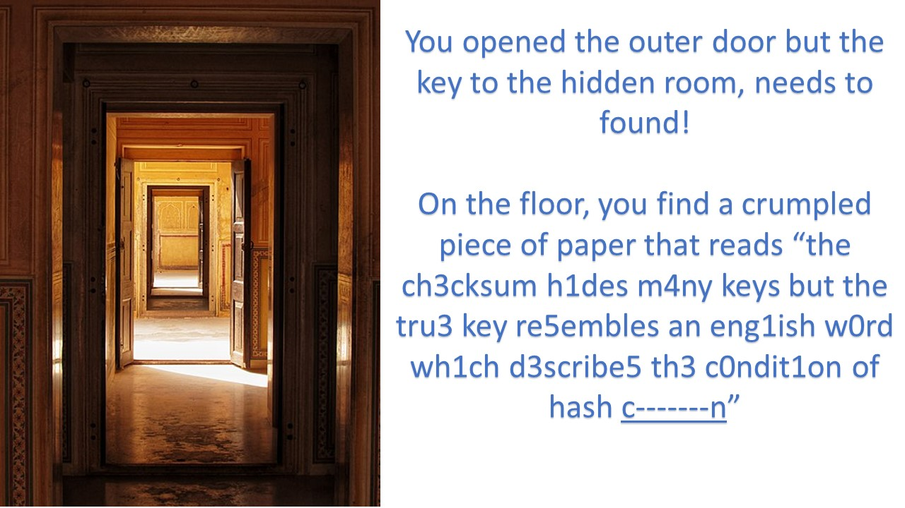

## PATIENT0
A file "PATIENT0" is given (it is exactly 6,291,456 bytes). It is an NTFS disk image. We can open up the file system using FTK imager.


There's probably 3 files of interest. The first is `broken.pdf`, which basically tells u the BPB is broken.

**1. The BPB is broken, can you fix it?**

The second file is `message.png`, shown below. 


Let's try to decode the message. `GIXFI2DJOJZXI6JAMZXXEIDUNBSSAZTMMFTT6ICHN4QGM2LOMQQHI2DFEBZXI4TFMFWS4CQ=`. Looks like its in base32.


**2.Thirsty for the flag? Go find the stream.**

The third is actually hidden in `message.png` as an Alternate Data Stream (`$RAND`) which is around 2049KB large. 


**3.Are these True random bytes for Cryptology?** --> Data is stored in TrueCrypt container

**4.If you need a password, the original reading of the BPB was actually Checked and ReChecked 32 times!** --> CRC32

### Clue
There is a free clue provided which is 


This should mean that the clue 1, which refers to the "BPB" being broken, actually refers to the BIOS parameter block. The 25 bytes of the BPB is listed below. Use this site [Boot Sector](https://www.datarecoveryunion.com/tag/ntfs-boot-sector/)

BPB `00 02 08 00 00 00 00 00 00 00 F8 00 00 00 00 00 00 00 00 00 00 54 49 53 43 F7 66 35 AB`                                                  
* `00 02` --> 512 bytes per sector 
* `08` --> 8 sectors per cluster
* `00 00` --> reserved
* `00 00 00` --> correct, must be 0 if not NTFS will not mount the volume 
* `00 00` --> correct, must be 0 if not NTFS will not mount the volume 
* `F8` --> media descriptor. `F8` means hard disk
* `00 00` --> correct, must be 0 if not NTFS will not mount the volume
* `00 00` --> not checked by NTFS
* `00 00` --> not checked by NTFS
* `00 00 00 00` --> not unused or checked by NTFS
* `54 49 53 43` --> **wrong**, must be 0 if not NTFS will not mount the volume
* `F7 66 35 AB` --> not used or checked by NTFS.

Looks like the last 8 bytes of the BPB is changed. The flag is `TISC{f76635ab}`.

`$RAND` basically contains 2 clues and in between the two clues, it is actually a True Crypt container. If we extract out the hex values, store them into a new file, and then use TrueCrypt to open it, we can then use the password f76635ab to decrypt the container.

We then obtain the following/Images image `outer.jpg`:



`the ch3cksum h1des m4ny keys but the tru3 key re5embles an eng1ish w0rd wh1ch d3scribe5 th3 c0ndit1on of hash c-------n`

Extracted numbers: 3143510135301
Letters (?) : eaesloieseoi

A free clue is given.


From the two clues, it seems like we have to look for some word that when CRC32-ed will give f76635ab.

Using leetspeak, we can convert `collision` to the password. 

```
echo 'f76635ab' > hash
hashcat -a -3 m 11500 ./hash --keep-guessing -1 olis0987654321
```

CRC32 of `c01lis1on` will be `f76635ab`.

`c01lis1on` can be used to decrypt the TrueCrypt hidden volume. 

Inside it contains a powerpoint file, there is a sound clip inside it, the MD5 hash of it is the flag. 

Flag: `TISC{f9fc54d767edc937fc24f7827bf91cfe}`